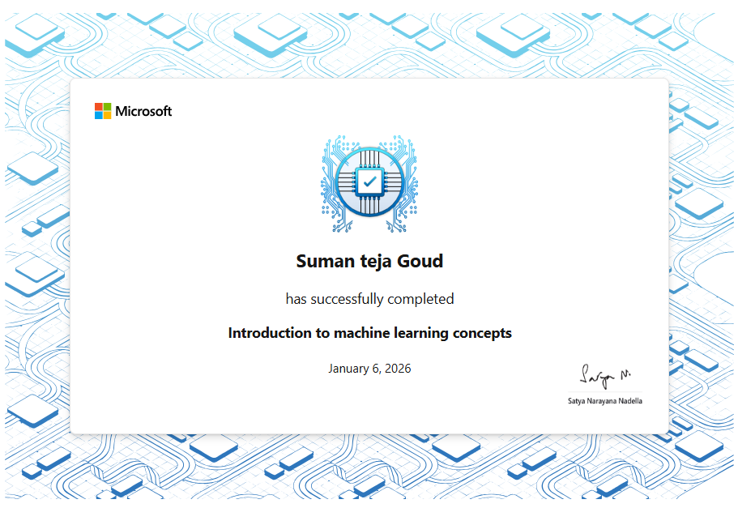

# Certifications

## Microsoft – Machine Learning Fundamentals

**Issuer:** Microsoft Learn  
**Status:** Completed (Assessment Passed)

### Skills Covered
- Machine Learning Fundamentals
- Regression, Classification, Clustering
- Model Training & Evaluation
- Deep Learning Basics

### Credential

🏅 Microsoft Learn Achievement Badge  

🔗 **Verify on Microsoft Learn (Achievements):**  
https://learn.microsoft.com/en-us/users/sumantejagoud-7676/achievements?tab=tab-modules
---

## Kaggle Learn – Intro to Machine Learning

**Issuer:** Kaggle  
**Status:** Completed (Certificate Earned)

### Skills Covered
- Supervised Machine Learning
- Model Training with Decision Trees
- Random Forests
- Model Validation & Evaluation
- Feature Engineering Basics

### Credential

🔗 **Verify on Kaggle Learn:**  
https://www.kaggle.com/learn/certification/sumantejagoud/intro-to-machine-learning

📁 **Related GitHub Project:**  
https://github.com/goudsumanteja/kaggle-intro-to-machine-learning
